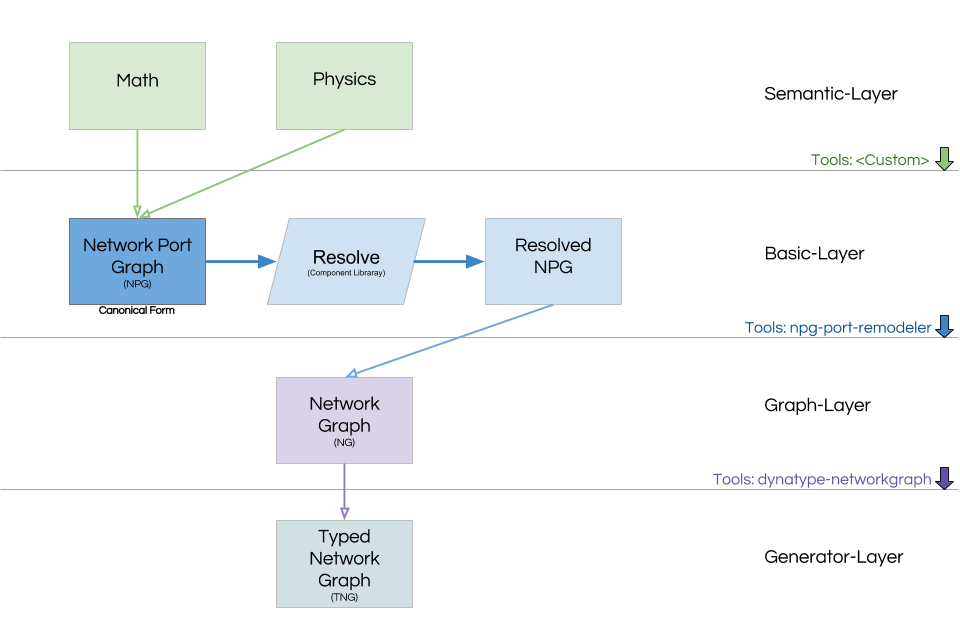

# Buggy Package

This package includes a CLI for the Buggy tool chain.

# Basic Idea

A program in Buggy can take up various different forms depending on the position in the
tool chain. The following pictures illustrates the different layers.



# Buggy CLI Interface

```json
{
"project": "Sort",
"file": "sort.clj",
"library": "http://libraryserver",
"targets": [
  {
    "compile":
    {
      "dependency": "@buggyorg/codegen^0.4.0",
      "args": ["--language", "c++", "--optimized"]
    }
  }],
"preprocessing": [
  {
    "@buggyorg/lisgy": {
      "handles": ".clj",
      "args": ["--fast"]
    },
    "yaml2json": {
      "handles": ".yaml",
      "runFormat": "<prog> --input <input-file> --output <output-file>"
    }
  }]
}
```

Call it from the Commandline via:

```
buggy compile
```

## Possible "Backends"

- API
- CLI
- Web-Service

## Definition of APIs in external programs

JSON definition of the API for a CLI-tool via `<prog> --buggy-api` e.g. `yaml2json --buggy-api`.
This could result in something similar to the following:

```json
{
  "name": "yaml2json",
  "binary": "/usr/bin/yaml2json",
  "description": "fancy tool with buggy api interface",
  "produces": "stdout", // or "file" ?
  "takes": "stdin", // of "file"
  "command": "yaml2json"
}
```

## Create a node module that exposes its API to buggy-cli

It must have a npm target to get information about the buggy-cli interface.

```
> npm run buggy-cli-info
{
  "name": "codegenerator",
  "description": "Creates code from buggy graphs",
  "buggy-version": "0.4.0"
}
```

It also must export `cliApi` as a function in its
main export (`package.json` → `"main"`). The function `cliApi` must
return an object of the following form:

```json
{
  "name": "codegeneration",
  "produces": "code",
  "dependencies": [
    "@buggyorg/resolve",
    {"package": "@buggyorg/optimize", "optional": true, "activateWhen": "optimize"}
  ]
}
```

There are two different dependencies. Required dependencies are always used when the
tool is used. Optional dependencies are only used when a specific option is set like `optimize`.
The attribute `activateWhen` specifies the command line parameter that activates the
step in the tool chain.
